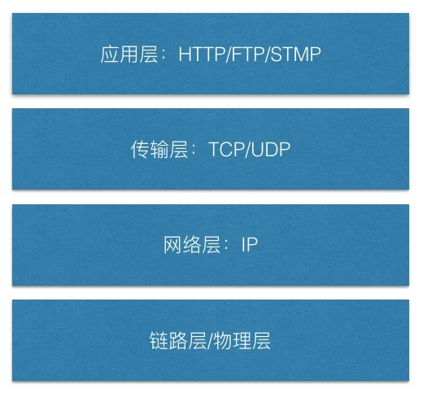
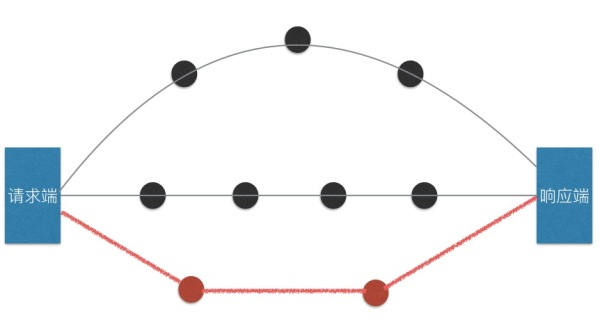

## HTTP
浏览器和服务器的相互通信使用的是HTTP协议（HyperText Transfer Protocol，超文本传输协议）。毫不夸张的说，整个互联网就是建立在HTTP协议基础之上的。

网络上不同硬件，不同操作系统的设备之间想要进行通信，就必须遵守相同的规则，如怎样发起通信、通信内容格式、如何结束通信等，这一系列事先约定的规则就是协议（protocol）。

HTTP是TCP/IP协议族的一个子集。TCP/IP协议族分为4层：应用层、传输层、网络层和数据链路层。
>“计算机科学的任何问题都可以通过增加一个中间层来解决”

## 应用层
应用层为应用程序提供网络服务。例如：FTP为文件传输提供服务、DNS为域名解析提供服务、SMTP为邮件传输提供服务、HTTP为浏览器和服务器通信提供服务。
## 传输层
传输层为应用层提供处于网络连接中的两台计算机之间的数据传输。

TCP(Transmission Control Protocol，传输控制协议)和 UDP(User Data Protocol，用户数据报协议)位于传输层。

TCP是可靠的传输协议。可靠意味着使用TCP传输的数据会准确无误的送达至目标。TCP通过三次握手来确保数据可靠送达：

- 请求端发送SYN（synchronize）包至接收端，并进入SYN_SEND状态，等待响应端确认；
- 响应端收到后SYN包后回传一个SYN/ACK（acknowledgement）包以示传达确认信息，响应端进入SYN_RECV状态；
- 请求端收到服务器的SYN/ACK包，向接收端回传ACK包，发送完毕后请求端和响应端进入ESTABLISHED状态，完成三次握手。
- 若在握手过程中某个阶段中断，TCP会再次以相同的顺序发送相同的数据包。

HTTP使用TCP。

UDP不提供数据包分组、组装，也不能对数据包进行排序。所以相对TCP来说，UDP不确保传输的可靠。

>我讲了一个UDP的笑话，但是你可能没听到🌚

## 网络层
IP是网络层最重要的协议。在请求端和响应端中可能存在多种连接方式，网络层为数据包选择合适的传输路径，如果数据包较大那么网络层会将其分为分为多个较小的数据包。

IP在进行中转时MAC 地址是指网卡所属的固定地址。IP 地址可以和 MAC 地址进行配对。IP 地址可变换，但 MAC 地址基本上不会更改。 

IP间的通信依赖MAC地址(Media Access Control Address，网卡所属的固定地址)。在进行数据包中转时，会通过ARP协议(Address Resolution Protocol：根据通信方的IP地址就可以反查出对应的MAC地址)找到下一站的MAC地址，直至数据包成功送达。 

> IP和IP地址：
IP是把各种数据包传送给对方的协议。IP地址是节点被分配到的地址。
链路层/物理层
链路层用来处理连接网络的硬件部分，如网卡驱动等。链路层之下是提供物理连接的物理层。
## 小结
HTTP可以简单的理解为客户端发出请求，服务器端响应该请求并返回。用于HTTP协议交互的信息被称为HTTP报文。

那么网页的传输就是浏览器通过HTTP向服务器发送一个获取网页的请求，服务器收到请求后返回网页这么简单吗？

显然不是。通过网络层协议我们可以得知，通常情况下浏览器的请求不会直达服务器，它们之间可能需要许多“中间人”。

*参考资料：《图解HTTP》*